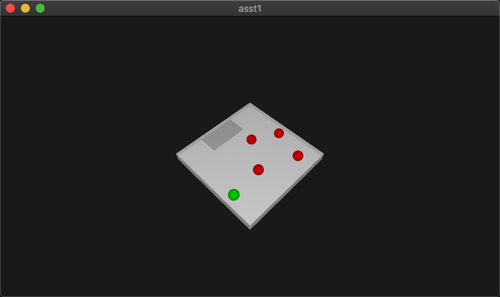

# CS6323 Animation and Gaming Project: Simple 3D prey-predator game with reinforcement learning strategy

This is a course project of CS6323 aiming to build a game in 3D scene. Alongside the game model which includes 3D object building, rendering, physical simulation and so on,
reinforcement learning is included to learn intelligent strategy for self-playing purpose.
